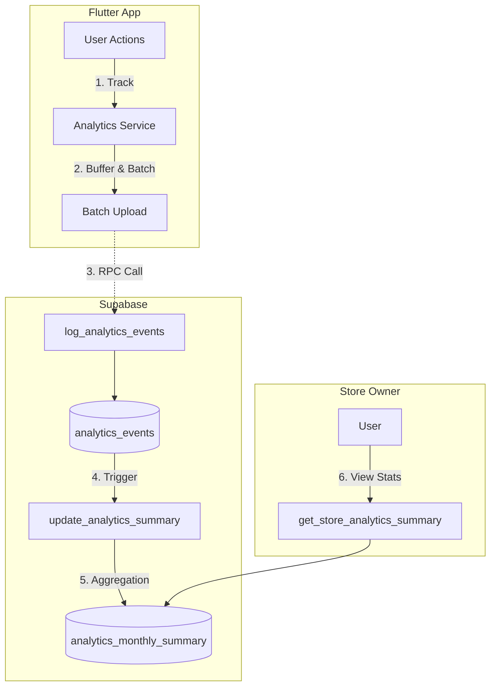

# Tryzeon App


## Getting Started

### 1. Install Flutter

Download and install Flutter from the official website:
- Visit [https://flutter.dev/docs/get-started/install](https://flutter.dev/docs/get-started/install)
- Follow the installation instructions for your operating system
- Verify installation by running:
  ```bash
  flutter doctor
  ```

### 2. Install Dependencies

Navigate to the project directory and install dependencies:
```bash
flutter pub get
```

run build runner
```bash
flutter pub run build_runner build --delete-conflicting-outputs
```

### 3. Open Simulator/Emulator

**For iOS (macOS only):**
```bash
open -a Simulator
```

**For Android:**
- Open Android Studio
- Go to Tools > Device Manager
- Start your preferred Android Virtual Device (AVD)

### 4. Run the Application

Run the app on simulator:
```bash
flutter run
```

Run the app on physical device:
```bash
flutter run --release
```

To run on a specific device:
```bash
flutter devices  # List available devices
flutter run -d <device-id>
```

### 5. Build the Application
build apk file for Android
```bash
flutter build apk
```

## Linter
```bash
dart fix --apply && dart format .
```

## Analytics System

### Traffic Flow


### Key Features
1. **Frontend**: Batched upload (10 events/5s), lifecycle awareness (auto-flush).
2. **Backend**: Trigger-based real-time aggregation, O(1) dashboard queries.
3. **Events**: `view` (Page/Impression), `try_on`, `purchase_click`.
