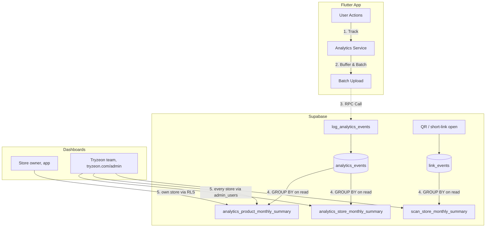

# Tryzeon - AI Virtual Try-On & Wardrobe Manager

**Tryzeon** is an advanced AI-powered virtual try-on and wardrobe management application designed for fashion lovers. By leveraging state-of-the-art Generative AI, Tryzeon allows users to digitally try on clothes with highly realistic results, seamlessly manage their personal wardrobe, and explore new fashion styles without limits.

## ✨ AI-Powered Features

- **AI Virtual Try-On**: Experience lifelike virtual try-ons using advanced image generation models. See exactly how an outfit looks on you before buying.
- **Smart Wardrobe Management**: Digitally organize and categorize your physical wardrobe effortlessly.
- **Intelligent Fashion Insights**: Discover new looks and experiment with limitless outfits.

## 🚀 Getting Started

### 1. Install Flutter

Download and install Flutter from the official website:
- Visit [https://flutter.dev/docs/get-started/install](https://flutter.dev/docs/get-started/install)
- Follow the installation instructions for your operating system
- Verify installation by running:
  ```bash
  flutter doctor
  ```

### 2. Install Dependencies

Navigate to the project directory and install dependencies:
```bash
flutter pub get
```

run build runner
```bash
dart run build_runner build --delete-conflicting-outputs
```

### 3. Open Simulator/Emulator

**For iOS (macOS only):**
```bash
open -a Simulator
```

**For Android:**
- Open Android Studio
- Go to Tools > Device Manager
- Start your preferred Android Virtual Device (AVD)

### 4. Run the Application

Run the app on simulator:
```bash
flutter run
```

Run the app on physical device:
```bash
flutter run --release
```

To run on a specific device:
```bash
flutter devices  # List available devices
flutter run -d <device-id>
```

### 5. Build the Application
build apk file for Android
```bash
flutter build apk
```

## Linter
```bash
dart fix --apply && dart format .
```

## Analytics System

### Traffic Flow

```mermaid
graph TD
    %% Frontend
    subgraph Frontend [Flutter App]
        User[User Actions] -->|1. Track| Queue[Analytics Service]
        Queue -->|2. Buffer & Batch| Batch[Batch Upload]
    end

    %% Backend
    subgraph Backend [Supabase]
        Batch -.->|3. RPC Call| API[log_analytics_events]
        API --> RawTable[(analytics_events)]
        Scan[QR / short-link open] --> LinkTable[(link_events)]

        RawTable -->|4. GROUP BY on read| ProductView[analytics_product_monthly_summary]
        RawTable -->|4. GROUP BY on read| StoreView[analytics_store_monthly_summary]
        LinkTable -->|4. GROUP BY on read| ScanView[scan_store_monthly_summary]
    end

    %% Dashboards
    subgraph Dashboards
        Owner[Store owner, app] -->|5. own store via RLS| ProductView
        Team[Tryzeon team, tryzeon.com/admin] -->|5. every store via admin_users| StoreView
        Team --> ProductView
        Team --> ScanView
    end
```

### Key Features
1. **Frontend**: Batched upload (10 events/5s), lifecycle awareness (auto-flush).
2. **Backend**: Events are append-only; every number is a `security_invoker` view that aggregates on read, bucketed by Asia/Taipei calendar month. Nothing is pre-computed, so a definition change needs no backfill. When the event tables outgrow this, swap a view for a `MATERIALIZED VIEW` behind the same name.
3. **Access**: RLS on the event tables — store owners read their own store, members of `admin_users` (via `is_admin()`) read every store.
4. **Events**: `view` (Page/Impression), `try_on`, `purchase_click`; QR opens live in `link_events`.
